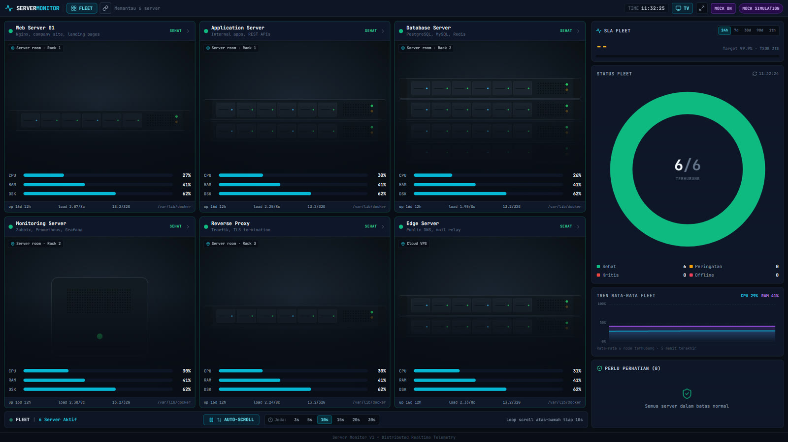
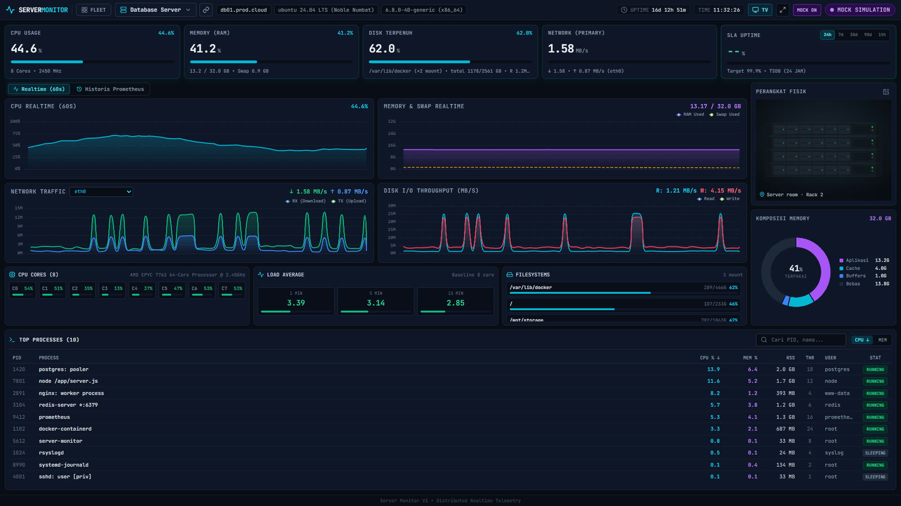
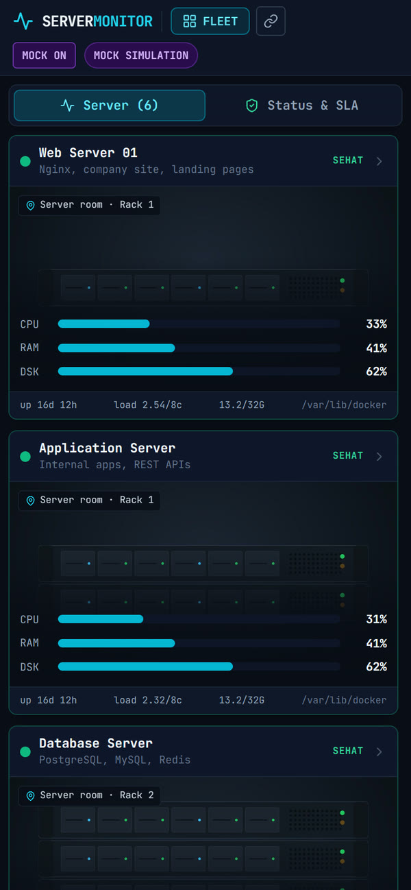

# Server Monitor

A dense, btop-style dashboard for a fleet of Linux servers, built to run all day on a NOC wall. It shows CPU per core, memory and swap, disks, network, load, top processes and SLA history for every node at once, and lets you drill into any one of them.

Each server runs one small Go agent that collects its own telemetry every second and streams it over WebSocket. The central server only hosts the static Vue 3 dashboard behind Nginx: there is no collector and no database to run.





<p align="center"></p>

<sub>Screenshots use the built-in mock mode and an example fleet; the device pictures are illustrations.</sub>

**Stack:** Go · gopsutil · WebSocket · Vue 3 · Vite · TypeScript · Tailwind CSS · Apache ECharts · Nginx · Prometheus (optional, for history and SLA) · Docker

---

## How it works

```
                     CENTRAL SERVER
                ┌──────────────────────┐
  TV on the ◄── │  Nginx               │
  wall          │  Vue 3 static dist/  │
                └──────────┬───────────┘
                           │  /servers/<id>/api  ·  /servers/<id>/ws
          ┌────────────────┼────────────────┐
          ▼                ▼                ▼
   ┌─────────────┐  ┌─────────────┐  ┌─────────────┐
   │   web01     │  │    db01     │  │   edge01    │
   │  Go agent   │  │  Go agent   │  │  Go agent   │
   │  gopsutil   │  │  gopsutil   │  │  gopsutil   │
   │  REST + WS  │  │  REST + WS  │  │  REST + WS  │
   └─────────────┘  └─────────────┘  └─────────────┘
```

- **No database.** Each agent keeps a rolling 60-second history in a thread-safe ring buffer in memory. Long-term history and SLA come from Prometheus when it is available.
- **No central collector.** The central server is only a static site and a reverse proxy. Adding a node never touches a backend.
- **One binary per node.** The agent is the collector, the REST API and the WebSocket broadcaster in one static Go binary (`CGO_ENABLED=0`), run by systemd.
- **Charts that do not stutter.** Each ECharts instance is created once and fed new data in place, so a dashboard left open for weeks does not leak or pause for garbage collection.
- **Alerts with patience.** CPU and memory alerts fire only after the threshold has held for a number of ticks, then cool down, so a busy minute does not page anyone.

## Quick start

Requirements: Go 1.24+ and Node.js 18+.

```bash
# Dashboard with simulated data, no agents needed
cd frontend && npm install
VITE_DATA_SOURCE=mock npm run dev        # http://localhost:3000
```

To watch a real machine, run an agent and point the dev proxy at it:

```bash
cd backend && go run ./cmd/server        # collects this machine's metrics on :9191
curl localhost:9191/api/v1/metrics

cd frontend && SRV_WEB01=localhost:9191 npm run dev
```

## Deployment

**1. On every monitored server**, install the agent as a systemd service:

```bash
cd backend && CGO_ENABLED=0 GOOS=linux go build -ldflags="-s -w" -o /opt/server-monitor/server-monitor ./cmd/server
sudo cp deploy/systemd/server-monitor.service /etc/systemd/system/
sudo systemctl daemon-reload && sudo systemctl enable --now server-monitor
```

Configuration lives in `/etc/server-monitor/server-monitor.env`; see [`backend/configs/config.example.env`](backend/configs/config.example.env). The agent runs on the host, not in a container, because a container would report its own view of CPU, memory and processes rather than the server's.

**2. On the central server**, describe the fleet and start the dashboard:

- [`frontend/public/servers.json`](frontend/public/servers.json) is the registry: id, name, role, location and an optional photo per node.
- [`deploy/docker/default.conf.template`](deploy/docker/default.conf.template) has one API and one WebSocket location per node.
- [`.env.example`](.env.example) holds each agent's address (`SRV_<ID>=host:port`).

```bash
cp .env.example .env
cd frontend && npm ci && npm run build && cd ..
docker compose up -d                     # http://<server>:8080
```

The registry, photos and proxy config are mounted from the host, so an address change only needs `docker compose up -d`, not a rebuild. Without Docker, [`deploy/nginx/nginx.conf`](deploy/nginx/nginx.conf) is the equivalent plain Nginx config.

## Views

| URL | For |
| :--- | :--- |
| `?view=fleet` | Every node at once: status, CPU / RAM / disk bars, fleet SLA, average trend and anything that needs attention. Auto-scrolls when there are more nodes than fit. |
| `?view=server&server=<id>` | One node in depth: per-core CPU, memory composition, network and disk I/O, filesystems, load average, top processes and Prometheus history. |

Each view can be pinned to its own display by URL. **TV** mode locks the layout to one screen; scroll mode is for laptops.

## Agent configuration

| Variable | Default | Meaning |
| :--- | :--- | :--- |
| `HTTP_ADDR` | `:9191` | Listen address |
| `SERVER_ID` | hostname | Name reported by the agent |
| `METRICS_INTERVAL` | `1s` | Sampling interval |
| `HISTORY_SIZE` | `60` | Samples kept in memory |
| `API_TOKEN` | empty | Optional bearer token for every route except `/health` |
| `CORS_ORIGINS` | `*` | Allowed origins |
| `ALERT_CPU_THRESHOLD` / `ALERT_MEM_THRESHOLD` | `95` / `95` | Alert thresholds in percent |
| `ALERT_DEBOUNCE_TICKS` | `15` | Samples above the threshold before an alert |
| `ALERT_COOLDOWN_MINUTES` | `15` | Quiet time after an alert |
| `WEBHOOK_ENABLED` | `false` | Post alerts to `WEBHOOK_URL`, e.g. an n8n workflow that forwards to Telegram or WhatsApp |

## API

```
GET /api/v1/health                 # public
GET /api/v1/server                 # host, OS, kernel, CPU model
GET /api/v1/status
GET /api/v1/metrics                # latest sample
GET /api/v1/history                # rolling in-memory history
GET /api/v1/filesystems
GET /api/v1/network/interfaces
GET /api/v1/processes
GET /ws/v1                         # live stream
```

## Tests

```bash
cd backend && go test ./...      # ring buffer, store, router auth, alert notifier
cd frontend && npm run build     # vue-tsc type-check + production build
```

The dashboard's interface text is in Indonesian.

## License

[MIT](LICENSE) © Radhian Sobarna
